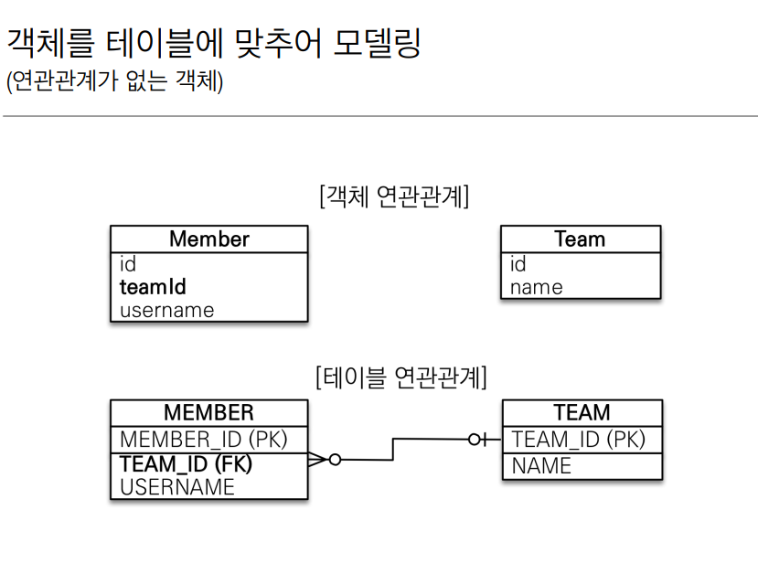
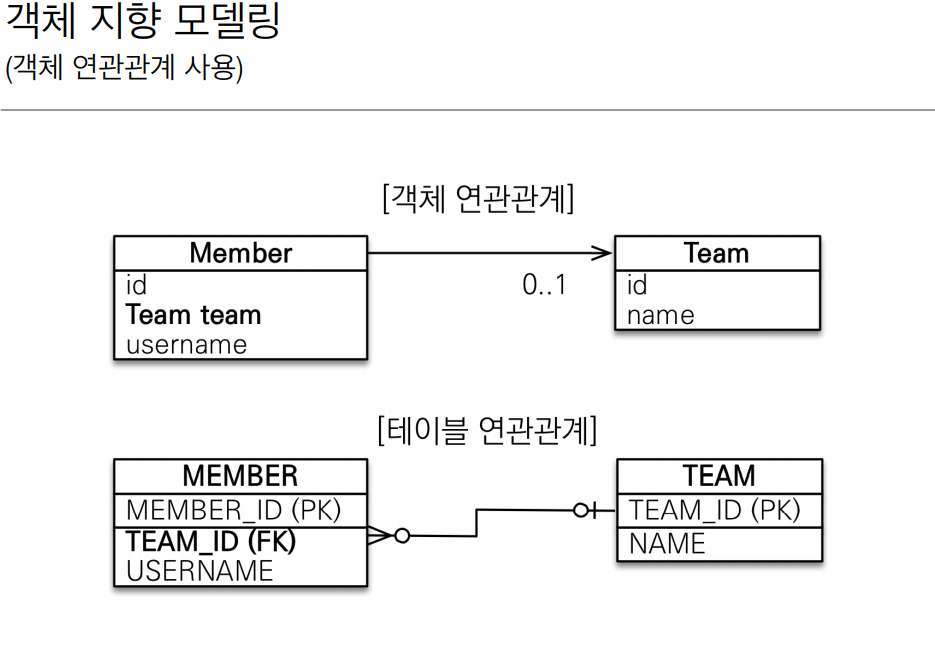
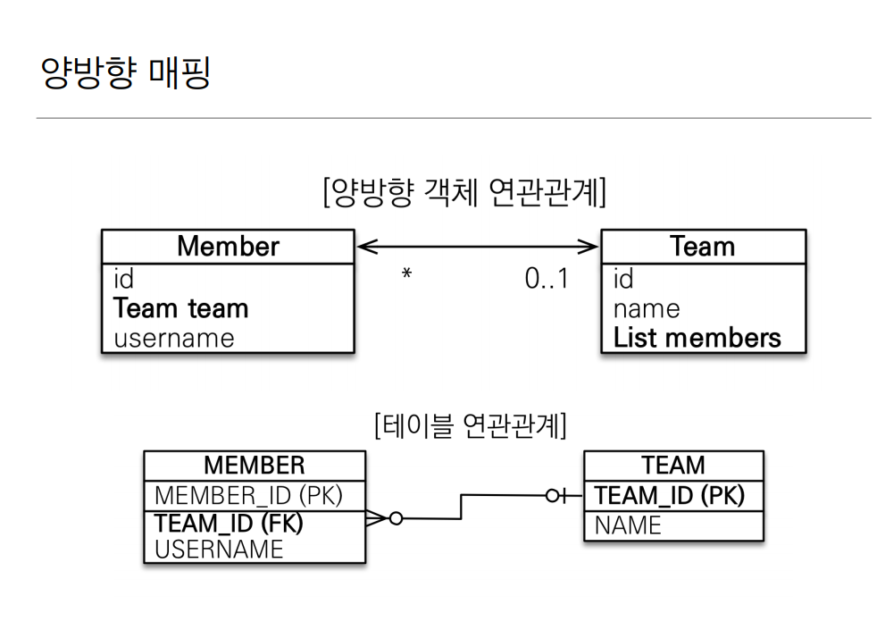

# 연관관계 매핑 기초


## 목표

-  객체와 테이블 연관관계의 차이를 이해
- 객체의 참조와 테이블의 외래 키를 매핑

- 용어 이해
    - 방향: 단방향, 양방향
    - 다중성: 다대일,일대다,일대일
    - 연관관계의 주인: 객체 양방향 연관관계는 관리 주인이 필요


---

## 연관관계가 필요한 이유

- 객체지향 설계의 목표는 자율적인 객체들의 협력 공동체를 만드는것
    - 추천 서적: 오브젝트, 객체지향의 사실과 오해

</br>

- 객체를 테이블에 맞추어 데이터 중심으로 모델링하면, 협력 관계를 만들 수 없다.
    - 테이블은 외래 키로 조인을 사용해서 연관된 테이블을 찾는다.
    - 객체는 참조를 사용해서 연관된 객체를 찾는다.

    </br>
    </br>

    

    - 엔티티 구성

    ```java

    //멤버 엔티티 구성
    @Entity
    @Getter
    public class Member{
        @id
        @GeneratedValue
        private Long id;

        @Column(name="USERNAME")
        private String name;

        @Column(name="TEAM_ID")
        private long teamId;

        public Member(){}

        public Member(String name,Long teamId){
            this.name= name;
            this.teamId=teamId;
        }
    }
    
    //Team 엔티티 구성
    @Entity
    @Getter
    public class Team{
        @Id GenratedValue
        private Long id;
        
        private String name;

        public Team(String name){
            this.name = name;
        }
    }

    ```

    - 데이터 저장(외래키 식별자를 직접다룬다 -객체지향적이지 못하다)
    ```java

    // 팀저장
    Team team = new Team("TeamA");
    em.persist(team); // GeneratedValue속성이 (autoincrement) 이면 이 시점에 1차캐시에 pk값 저장되고 영속상태로된다.
    // 멤버저장
    Member member = new Member("멤버1번",team.getId());
    em.persist(member);

    em.flush();
    em.clear();
    // 조회
    Member findMember = em.find(Member.class,member.getId());
    // 연관관계가 없다. Member에서 team객체를 가져올 수 없다. 
    Team findTeam = em.find(Team.class,team.getId())

    ```

- ## 단방향 연결 관계

    - 객체 지향 모델링 (참조값을 그대로 가져옴)
    - Member만 Team을 참조하고있다. (Team은 Team객체 스스로가 멤버를 가지고있지않음)
    </br>

    

    ```java
    @Entity
    public class Member{
        @id
        @GeneratedValue
        private Long id;

        @Column(name="USERNAME")
        private String name;
        
        @ManyToOne
        @JoinColumn(name="TEAM_ID") // merber테이블의 TEAM_ID매핑
        private Team team;

        public void teamChange(Team team){
            this.team = team;
        }


    }

    ```

    - (단방향) 연관관계 
    
    ```java

    //저장
    Team team = new Team("teamA");
    em.persist(team);


    // 객체를 참조하고있다.
    Member member = new Member("Member1",team);
    em.persist(member); 
    
    Team  teamb new  Team("TeamB")
    em.persist(teamb)

    // member.team --> teamb
    member.teamChange(B);


    ```


- ## 양방향 연관관계와 연관관계의 주인

    </br>

    -   양방향 매핑(Team에서도 Member를 참조해서 갈 수 있다.)
    
    </br>

    

    </br>

    - 양방향 매핑(Team부분만 수정)


    </br>

    ```java
    @Entity
    @Getter
    public class Team{
        @Id GenratedValue
        private Long id;
        
        private String name;

        @OneToMany(mappedBy = "team")
        List<Member> members = new ArrayList<Member>();
        // 관례 -> 생성할 떄 바로 초기화

        public Team(String name){
            this.name = name;
        }
    }

    ```

    - 반대 방향으로 객체 그래프 탐색

    ```java

    Team findTeam = em.find(Team.class,team.getId());
    int memberSize = findTeam.getMembers().size();  // 팀을 통해 멤버 객체 조회 


    ```


    - ### 연관관계의 주인과 mappedBy
        - 객체의 양방향 관계
            - 객체의 양방향 관계는 사실 양방향 관계까 아니라 서로 다른 단방향 관계 2개다

            - 객체를 양방향으로 참조하려면 단방향 연관관계를 2개 만들어야 한다.

        - 테이블의 양방향 연관관계
            - 테이블은 외래 키 하나로 두 테이블의 연관관계를 관리

            - MEMBER.TEAM_ID 외래 키 하나로 양방향 연관관계 가짐(양쪽으로 조인할 수 있다.)


        - 연관관계의 주인(Owner)
            - 양방향 매핑 규칙
                - 객체의 두 관계중 하나를 연관관계의 주인으로 지정
                - 연관관계의 주인만이 주인만이 외래 키를 관리(등록, 수정)
                    - 연관관계를 저장할 때 DB에는 주인쪽에서만 저장된다
                    
                    ```java
                        public void addMember(Member member){
                        member.setTeam(this); // 실직적으로 Member 테이블의 teamId값만 저장된다.
                        members.add(member); 
                    }

                    ```
                - 주인이 아닌쪽은 읽기만 가능
                    - List를 불러와 읽을 수 있다. </br> 
                    ex) int memberSize= findTeam.getMembers().size();

                    ```java

                    // Team을 통해 Member조회
                    Team team1 = em.find(Team.class, team.getId());
                    System.out.println("team1"+team1.getMembers());
                    // 쿼리문 
                    select
                        members0_.TEAM_ID as team_id9_3_0_,
                        members0_.MEMBER_ID as member_i1_3_0_,
                        members0_.MEMBER_ID as member_i1_3_1_,
                        members0_.age as age2_3_1_,
                        members0_.city as city3_3_1_,
                        members0_.street as street4_3_1_,
                        members0_.zipcode as zipcode5_3_1_,
                        members0_.USERNAME as username6_3_1_,
                        members0_.TEAM_ID as team_id9_3_1_,
                        members0_.endDate as enddate7_3_1_,
                        members0_.startDate as startdat8_3_1_ 
                    from
                        Member members0_ 
                    where
                        members0_.TEAM_ID=? 


                    ```

                - 주인은 mappedBy 속성 사용 X
                - 주인이 아니면 mappedBy속성으로 주인지정
            - 주인 지정은 외래 키가 있는 곳을 주인으로 정해라(다대일)

            - 양방향 매핑시 양족에 값을 넣어야 한다.
                - Member 와 Team 둘다 서로를 참조하도록 설정해야한다.
                - Member에만 team을 넣고 Team에다가 member를 안넣으면 단방향임

- ## 양방향 매핑 정리
     - 단방향 매핑만으로도 이미 연관관계 매핑은 완료
     - 양방향 매핑은 반대 방향으로 조회(객체 그래프 탐색) 기능이 추가된 것 뿐 

     - JPQL에서 역방향으로 탐색할 일이 많음(Id를 조회해서 ID를 통해 값을 가져오는건 불편함 객체지향적이지 않음)

     - 단방향 매핑을 잘 하고 양방향은 필요할 떄 추가해도 됨
     (테이블에 영향을 주지 않는다. 관계 주인만 DB에 영향을 준다)

     - 양방향 매핑시에 무한루프 조심하기
        - toString() - toString수정하기
            ```java
            // Member Tostirng
            @Override
            public String toString() {
                return "Member{" +
                        "id=" + id +
                        ", name='" + name + '\'' +
                        ", team=" + team +
                        '}';
            }

            //team toString

            @Override
            public String toString() {
                return "Team{" +
                        "id=" + id +
                        ", name='" + name + '\'' +
                        ", members=" + members +
                        '}';
            }
            ```

            </br>

            ```java
              //오류 코드
                Exception in thread "main" java.lang.StackOverflowError
                at java.base/java.util.AbstractCollection.toString(AbstractCollection.java:465)
                at org.hibernate.collection.internal.PersistentBag.toString(PersistentBag.java:622)
                at java.base/java.lang.String.valueOf(String.java:2951)
                at hello.jpa.Team.toString(Team.java:33)
            ```
        - 연관관계 매서드 한 곳에만 설정하기
        - 컨트롤러에서는 엔티티 반환 x -> API스펙변화 (1번 API는 username이 N OTNULL인데 2번API는 usernamedl NOT NULL이 아닐 경우 매번 엔티티 수정해야함 --> DTO 변환해서 반환하기)
        