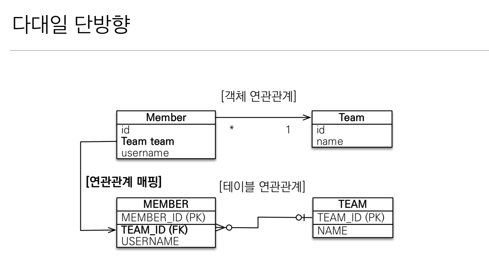
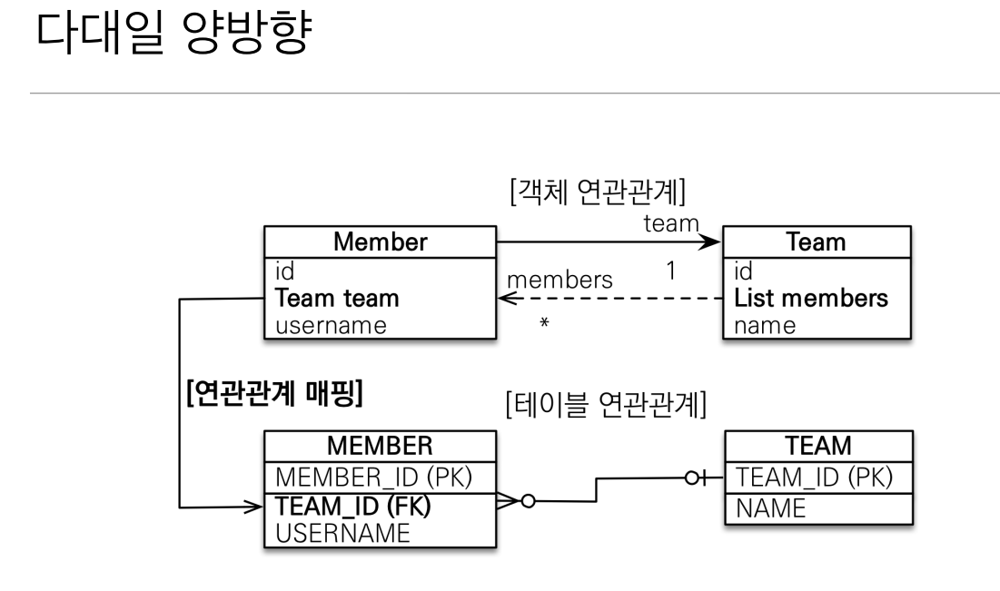
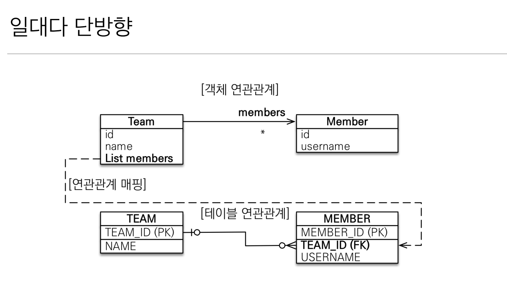
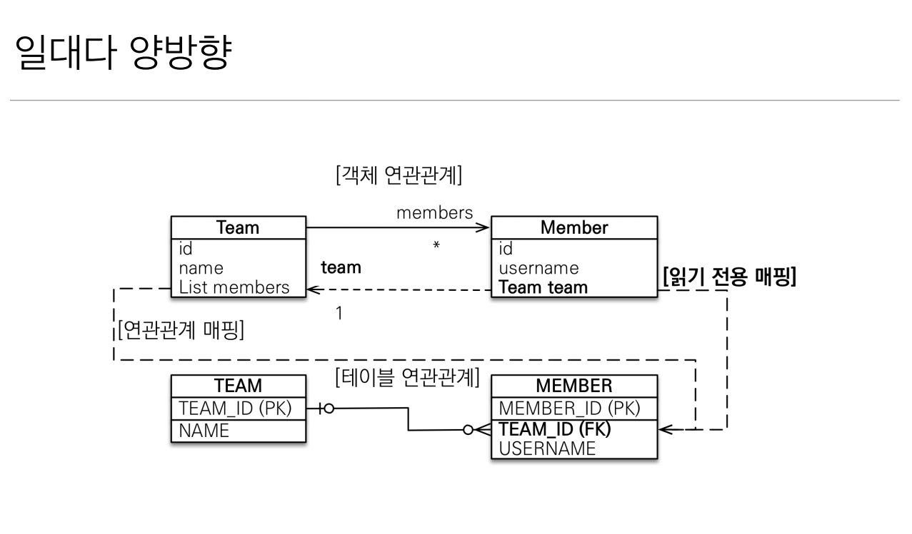
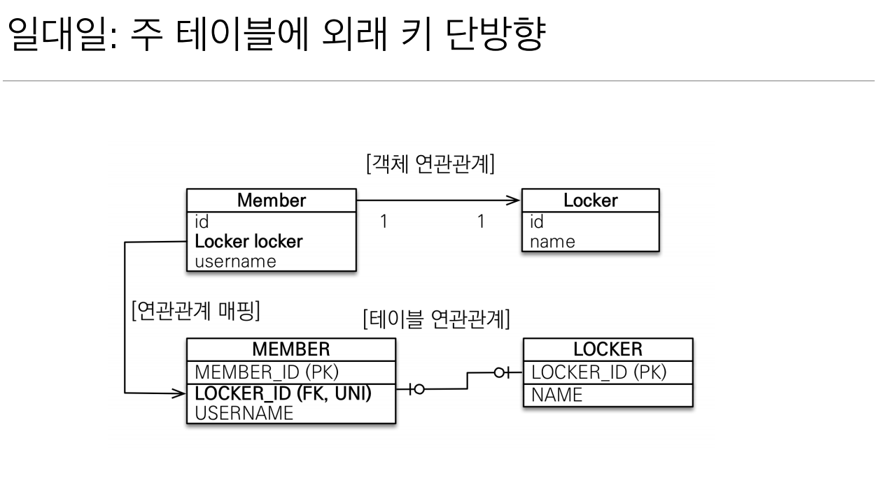
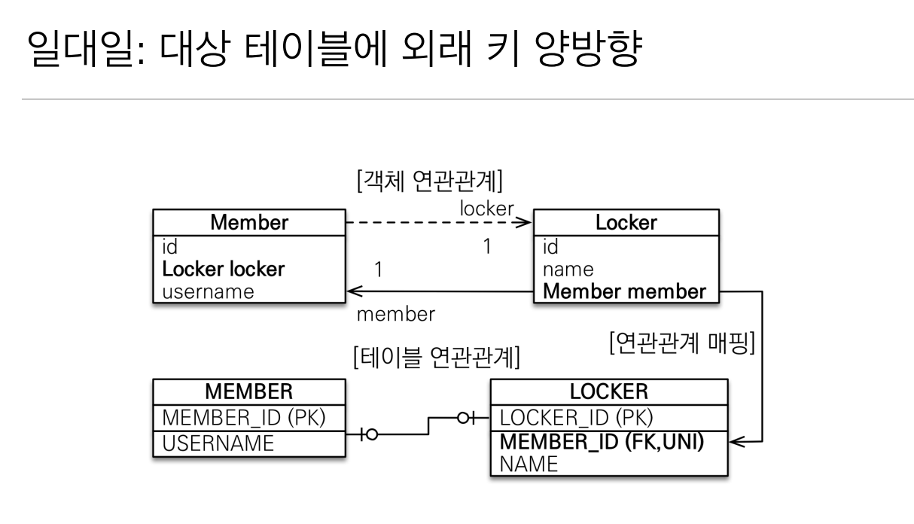
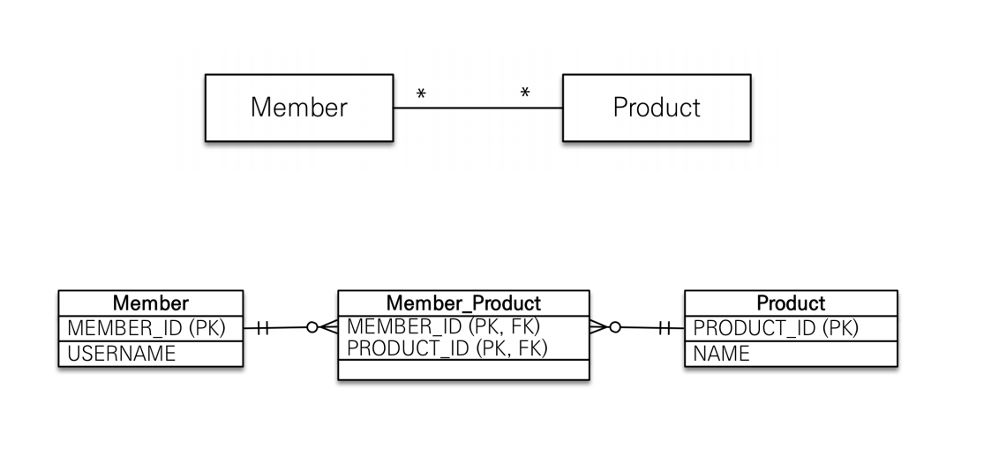
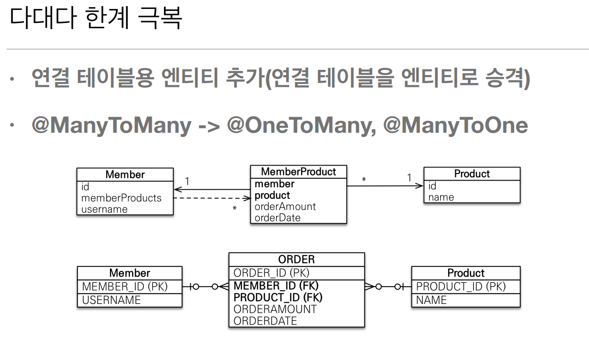

# 5주차

- 다양한 연관관계 매핑

- 목차
    - 연관관계 매핑시 고려사항 3가지
    - 다대일
    - 일대다
    - 일대일
    - 다대다


- ## 연관관계 매핑시 고려사항 3가지
    - 다중성(JPA어노테이션) 
        - 다대일:@ManyToOne -> 일대다와 대칭
        - 일대다 @OneToMany -> 다대일과 대칭

        - 일대일 :@OneToOne
        - 다대다: @ManyToMany
    - 단방향,양방향
        - 테이블 
            - 외래 키 하나로 양쪽 조인 가능
            - 사실 방향이라는 개념이 없음
        - 객체
            - 참조용 필드가 있는 쪽으로만 참조가능
            - 한쪽만 참조하면 단방향
            - 양쪽이 서로 참조하면 양방향 (객체 입장에서는 단방향2개를 의미함)
    - 연관관계의 주인
        - 테이블은 외래 키 하나로 두 테이블이 연관관계를 맺음
        - 객체 양방향 관계는 A -> B, B->A 처럼 참조가 2군데
        - 연관관계의 주인: 외래 키를 관리하는 참조
        - 주인의 반대편: 외래 키에 영향을 주지 않음, 단순 조회만 가능(읽기전용,DB에 영향을 주지 않는다.)


 ## 다대일 (JPA에서 많이 사용된다.)

<br>

- 다 쪽에 외래키가 있다.
- 외래키와 외래키관련 필드변수와 매핑
- 객체는 참조(주소)로 연관관계를 맺는다.

<br>

- 단방향 매핑




```java
// 단방향 매핑일 경우 외래키가있는 곳에서 참조용 필드와 외래키의 관계만 설정해주면 된다.
@Entity
class Member {
    @ManyToOne(fetch = FetchType.LAZT)
    @JoinColumn(name="TEAM_ID")
    private Team team;
}

```

- 다대일 양방향




-  다대일에서 일에 해당하는 클래스에서 다쪽을 조회하는 로직이 많이 발생할 경우  양방향으로 설정

- 양방향을 설정해도 외래키와 관련이 없기 때문에 DB에 영향을 주지 않는다.

- 양쪽을 서로 참조하도록 개발.

```java
@Entity
public class Team

@id @GeneratedValue
private Long id;
// 참조용 필드 선언 -리스트
@OneToMany(mappedBy = "team")
private List<Member>Members = new ArrayList<>();

// 1차캐시가 비워져 있을 경우 team의 id값을 이용해 DB에서 member들을 조회하여 members에 넣어서 반환한다. 

```


---
 ## 일대다(다대일이랑 테이블은 같다) 

- ### 단방향    




```java

public class Team{
    @OneToMany
    @JoinColumn(name="TEAM_ID") // JoinColumn을 사용하지 않을 경우 조인 테이블 전략을 사용한다 - > MEMBER_TEAM라는 테이블을 만들어 TEAM과 MEMBER테이블을 매핑시켜준다.
    private List<Member> members= new ArrayList<>();
}

```

- 일이 연관관계의 주인
- 테이블 일대다 관계는 항상 다족에 외래 키가 있음
    - 객체와 테이블 차이 떄문에 반대편 테이블의 외래 키를 관리하기 위해 업데이트쿼리가 하나더 나간다 -> 운영이힘들어진다.

- 일대다 단방향 매핑보다는 다대일 양방향 매핑을 사용하기


- ### 양방향





```java
public class Member{

    @ManyToOne
    @JoinColumn(name = "TEAM_ID", insertable = false, updatable= false) // insert 와 update쿼리가 안나가게 한다. 
    private Team team;
}


```

- 이런 매핑은 공식적으로 존재X
- 읽기 전용 필드를 사용해서 양방향 처럼 사용하는 방법
- 다대일 양방향 사용하기


---
## 일대일
- 일대일 관계는 그 반대도 일대일
- 주 테이블이나 대상 테이블 중에 외래 키 선택가능
    - 주 테이블에 외래키
    - 대상 테이블에 외래 키
- 외래 키에 데이터베이스 유니크 제약조건 추가

<br>

### 단방향(주 테이블에 외래 키 단방향)

<br>




- 다대일 단방향과 매핑과 유사

```java
@Entity
class Member {
    @Id @GeneratedValue

    @OneToOne
    private Locker locker;
}
```

<br>

 ### 양방향
- 다대일 양방향과 비슷
     - 외래 키가 있는 곳이 연관관계의 주인 (보통 이방법을 많이사용한다)

```java
// Member클래스는 위와 동일

public class Locker{

    @OneToOne(mappedBy="locker")
    private Member member;
}


```

### 대상 테이블에 외래 키 단방향
- 지원하지 않는다.

### 대상 테이블에 외래 키 양방향



- 일대일 주 테이블에 외래 키 양방향과 매핑 방법은 같다.    

```java
@Entity
class Member{
    @OneToOne(mappedBy="member")
    private Locker locker; // 읽기전용으로 만든다. DB에 영향을 주지 않는다.
}

```

- 주테이블에 외래 키
    - 주 객체가 대상 객체의 참조를 가지는 것 처럼 주 테이블에 외래 키를 두고 대상 테이블을 찾음
    - 객체지향 개발자 선호
    - JPA 매핑 편리
    - 장점: 주 테이블만 조회해도 대상 테이블에 데이터가 있는지 확인 가능
    - 단점: 값이 없으면 외래 키 null값 허용

- 대상 테이블에 외래 키 (양방향으로 만들어야함)
    - 대상 테이블에 외래 키가 존재
    - 전통적인 DB개발자 선호
    - 장점: 주 테이블과 대상 테이블을 일대일에서 일대다 관계로 변경할 떄 테이블 구조 유지
    - 단점: 프록시 기능의 한계(지연 로딩으로 설정해도 항상 즉시 로딩됨)
        - 주 테이블에서 조회할 떄 무조건 대상테이블에서 조회를 해야 되기 때문에 2번 select문이 발생 

- 주테이블에 외래키를 두고 사용하는것을 추천.

---
## 다대다
- 관계형 데이터베이스는 정규화된 테이블 2개로 다대다 관계를 표현할 수 없다.
- 연결 테이블을 추가해서 일대다, 다대일 관계로 풀어내야함

- 객체는 컬렉션을 사용해서 객체 2개로 다대다 관계가능



- 다대다 예시 

```java

@Entity
public class Member{

    @ManyToMany
    @JoinTable( name="MEMBER_PRODUCT")
    private List<Product> products = new ArrayList<>();
}

```

- 양방향 설정

```java

@Entity
public class Product{
    
    @ManyToMany(mappedBy="products")
    private List<Member> member = new ArrayList<>();
}

```

- 다대다 매핑 한계
    - 보통 연결 테이블이 단순히 연결만 하고 끝나지 않는다.
        - 추가 컬럼이 필요하지만 다대다 매핑을 할 경우 컬럼을 추가할 수 없다.


- ## 극복 
    - 연결 테이블용 엔티티 추가( 연결 테이블을 엔티티로 승격)
    - ManyToMany -> @OneToMany , @ManyToOne

    

    ```java
    //member 클래스
    @Entity
    public class Member{
        @OneToMany(mappedBy="member")
        private List<MemberProduct> memberProduct = new ArrayList<>();
    }

    // product 클래스
    @Entity
    public class prodcut{
        @OneToMany(mappedBy="product")
        private List<MemberProduct> memberProduct = new ArrayList<>();
    
    }
    // 연결 클래스
    @Entity
    public class MemberProduct{
        @ID @GeneratedValue
        private long id; // member_id 와 product_id를 사용해도되지만 의미없는 대리키로 기본키를 만들면 유연성이 높아지고 , JPA매핑도 쉬워진다.

        @ManyToOne
        @JoinColumn(name ="MEMBER_ID")
        private Member member;

        @ManyToOne
        @JoinColumn(name="PRODUCT_ID")
        private Product product;

    }


    ```