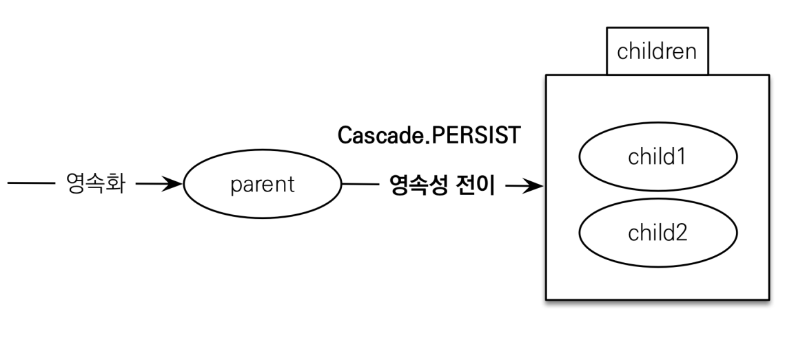

# 프록시

- ## 프록시란?
    - JPA 구현체들은 연관된 객체들을 처음부터 데이터베이스에서 조회하는 것이 아니라, 실제 사용하는 시점에 데이터베이스에서 조회할 수 있다. 이와 관련 된 기술이 프록시인데, 이 프록시를 통해 지연로딩, 즉시로딩을 할 수 있다.

    - 기초
        - em.find() : 데이터베이스를 통해서 실제 엔티티 객체 조회
        - em.getReference(): 데이터베이스 조회를 미루는 프록시엔티티 객체 조회
            - getReference는 실제로 많이 안쓰임(참고용)
    - 특징
        - 실제 클래스를 상속 받아서 만들어짐
        - 실제 클레스와 겉 모양이 같다.
        - 사용하는 입장에서는 진짜 객체인지 프록시 객체인지 구분하지 않고 사용하면 됨(이론상)

        - 프록시 객체는 실제 객체의 참조를 보관
        
        - 프록시 객체는 식별자 값을 가지고 있으므로 만약 식별자 값을 조회하는 getId()를 호출해도 프록시를 초기화 하지 않는다.
        
        - 프록시 객체를 호출하면 프록시 객체는 실제 객체의 메소드를 호출 

            ``` java
            class Proxt extends Entity{
                Entity target = null;
                public String getName(){
                    if target == null){
                        1. 초기화 요청
                        2. DB조회
                        3. 실제 엔티티 참조보관
                    this.target = (result)
                    }
                    return target.getName();
                }
            }
            ```
        - 프록시 객체는 처음 사용할 때 한 번만 초기화
        - 프록시 객체를 초기화 할 때, 프록시 객체가 실제 엔티티로 바뀌는 것은 아니다, 초기화되면 프록시 객체를 통해서 실제 엔티티에 접근 가능
        - 프록시 객체는 원본 엔티티를 상속받ㅇ,ㅁ 따라서 타입 체크시 주의해야한다. (== 비교 실패, 대신 instanceof사용)
        - 영속성 컨텍스트에 찾는 엔티티가 이미 있으면 em.getReference()를 호출해도 실제 엔티티 반환
            - 반대도 똑같이 적용된다.(프록시를 먼저 찾으면 find()도 프록시를 호출한다.)
        
        - 영속성 컨텍스트의 도움을 받을 수 없는 준영속 상태일 때, 프록시를 초기화하면 문제가 발생한다.
    - 프록시를 확인하는 방법
        - 프록시 인스턴스의 초기화 여부 확인
            - PersistenceUnitUtil.isLaded(Object entity)
        
        - 프록시 클래스 확인방법
            - entity.getClass().getName()출력(..javasist.. ort HibernateProxt.. 라고뜬다)
        
        - 강제 초기화
            - org.hibernate.Hibernate.initialize(entity);


-  즉시 로딩과 지연 로딩
    - 즉시로딩 
        - 엔티티 조회 시 연관관계에 있는 데이터까지 한 번에 조회해오는 기능, 
        fetch= FetchType.EAGER옵션으로 지정할 수 있다.
        - 문제점
            - JPQL에서 N+1문제를 일으킨다.
                - 멤버를 조회할 떄 멤버의 데이터 양만큼 쿼리문이 증가한다.
                    - 각각 멤버 아이디마다 팀을 조회하기 위해서 멤버의 수만큼 쿼리증가
            - 즉시로딩을 적용하면 예상하지 못한 SQL이 발생
                - 연관된 객체가 많을 경우 속도가 느려질 수 있다. ex) 멤버에 참조객체가 5개가 있을 경우 참조객체 5개에 대한 조인이 매번 발생한다.
                
    - 지연 로딩
        - 엔티티 조회 시점이 아닌 엔티티 내 연관관계를 참조할 떄 해당 연관관계에 대한 SQL이 질의되는 기능이다.
            - 연관관계 필드는 프록시 객체로 제공된다.
        - fetch = FetchType.LAZY 로 설정할 수 있다.
        - @ManyToOne,@OneToOne은 기본이 즉시로딩이다 LAZT로 설정해주기
        - 가급적 지연 로딩만 사용하기
        ```java
        memeber.getTeam() // 프록시 객체 초기화x
        member.getTeam().getName() // 프록시 객체 초기화 및 db조회
        ```
    
    - 결론
        - 모든 연관관계에 지연 로딩을 사용해야 한다.
            - 즉시로딩은 예상치못한 쿼리가 나간다.
            - 즉시로딩은 N+1 문제가 발생한다 


- ## 영속성 전이: CASCADE
    - 특정 엔티티를 영속 상태로 만들 때 연관된 엔티티도 함께 영속 상태로 만들고 싶을 때 사용 ex) 부모 엔티티를 저장할 때 자식 엔티티도 함께 저장.

    - 사용 방법 
    ```java
    // 부모클래스
    @OneToMany(mappedBy='parent", cascade = CascadeType.PERSIST)
    privaet List<Child> childList = new ArrayList<>();

    addChild(Child child){
        this.getChildList().add(child);
        child.setParent(this);
    }

    // 자식클래스
    @ManyToOne
    private Parent parent;

    //부모 클래스에 데이터를 추가할 경우
    Parent parent = new Parent();
    Child child =  new Child();
    parent.addChild(child);
    em.save(parent);  // 이때 Cascade를사용하면 child도 자동으로 영속화가 된다.

    ```
    

    - 주의할 점
        - 영속성 전이는 연관관계를 매핑하는 것과 아무 관련이 없다.
        - 하나의 부모가 관리할 떄 사용, 소유주가 하나일 때 ex) 게시글- 첨부파일

    - 속성
        - ALL:모두 적용
        - PERSIST: 영속
        - REMOVE: 삭제
        - MERGE: 병합
        - REFRESH: REFRESH
        - DETACH: DETACH

    
- ## 고아 객체
    - 부모엔티티와 연관관계가 끊어진 자식 엔티티

    - 고아 객체 제거: 부모 엔티티와 연관관계까 끊어진 자식 엔티티를 자동으로 삭제

        - orphanRemoval= True 속성으로 활용
            ```java
            // 속성을 TRUE로 했을 경우 .
            Parent parent1 = em.find(Parent.class,id);
            parent1.getChildrent().remove(0);
            // 자식 엔티티를 컬렉션에서 제거 
            // - > DELETE FROM CHILD WHERE ID= ? 발생
            ``` 
    - 주의점
        - 참조가 제거된 엔티티는 다른 곳에서 참조하지 않는 고아 객체로 보고 삭제 하는 기능
            - 참조하는 곳이 하나일 떄 사용해야 한다.
            - 특정 엔티티가 개인 소유할 때 사용
            - @OneToOne,@OneToMany 에서만 가능
            - 개념적으로 부모를 제거하면 자식은 고아가 된다. 따라서 고아 객체 제거 기능을 활성화 하면, 부모를 제거할 떄 자식도 함께 제거 된다. 이것은 CascadeType.REMOVE처럼 동작한다.

- ## 영속성 전이+ 고아 객체, 생명주기
    - CascadeType.ALL + orphanRemovel=true을 활용한다.

    - 스스로 생명주기를 관리하는 엔티티는 em.persist()로 영속화, em.remove()로 제거
        - JPA를 통해서 생명주기를 관리할 수 있다.

    
    - 두 옵션을 모두 활성화 하면 부모 엔티티를 통해서 자식의 생명 주기를 관리할 수 있음.
    - 도메인 주도 설계의 Aggregate Root개념을 구현할 때 유용하다.

